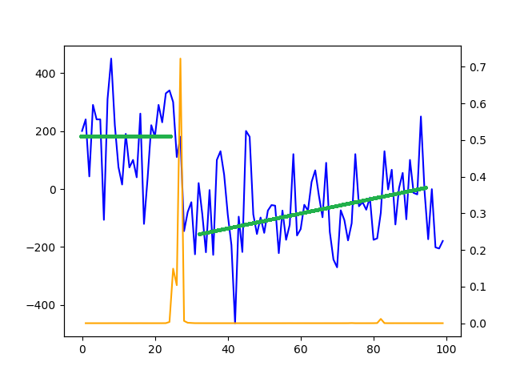

# 用贝叶斯方法找拐点

随着时间推移，贴片机的贴片位置由于各种原因会产生小的偏差。这些偏差可能是阶跃，也有可能是渐变的形式。由于偏差值很小，产线的AOI（自动光学检测）设备并不会报警；然而小的偏差如果不经处理，经过一定时间累积会产生较大偏差，影响产品质量。

为了能够提前发现贴片偏差并在产生质量问题以前及时调整，产线工程师需要有工具能够持续监测贴片机各个部件的性能，在出现平均值或标准偏差的拐点时提醒工程师及时做设备调整。

这是一类时间序列检测拐点的问题，可以通过贝叶斯方法求解任意时间点出现拐点的概率。

### 贝叶斯方法基础

摘抄自[刘未鹏：平凡而又神奇的贝叶斯方法](http://mindhacks.cn/2008/09/21/the-magical-bayesian-method/)

贝叶斯公式是怎么来的？

我们还是使用 wikipedia 上的一个例子：

*一所学校里面有 60% 的男生，40% 的女生。男生总是穿长裤，女生则一半穿长裤一半穿裙子。有了这些信息之后我们可以容易地计算“随机选取一个学生，他（她）穿长裤的概率和穿裙子的概率是多大”，这个就是前面说的“正向概率”的计算。然而，假设你走在校园中，迎面走来一个穿长裤的学生（很不幸的是你高度近似，你只看得见他（她）穿的是否长裤，而无法确定他（她）的性别），你能够推断出他（她）是男生的概率是多大吗？*

一些认知科学的研究表明（《决策与判断》以及《Rationality for Mortals》第12章：小孩也可以解决贝叶斯问题），我们对形式化的贝叶斯问题不擅长，但对于以频率形式呈现的等价问题却很擅长。在这里，我们不妨把问题重新叙述成：你在校园里面随机游走，遇到了 N 个穿长裤的人（仍然假设你无法直接观察到他们的性别），问这 N 个人里面有多少个女生多少个男生。

你说，这还不简单：算出学校里面有多少穿长裤的，然后在这些人里面再算出有多少女生，不就行了？

我们来算一算：假设学校里面人的总数是 U 个。60% 的男生都穿长裤，于是我们得到了 U \* P(Boy) \* P(Pants|Boy) 个穿长裤的（男生）（其中 P(Boy) 是男生的概率 = 60%，这里可以简单的理解为男生的比例；P(Pants|Boy) 是条件概率，即在 Boy 这个条件下穿长裤的概率是多大，这里是 100% ，因为所有男生都穿长裤）。40% 的女生里面又有一半（50%）是穿长裤的，于是我们又得到了 U \* P(Girl) \* P(Pants|Girl) 个穿长裤的（女生）。加起来一共是 U \* P(Boy) \* P(Pants|Boy) + U \* P(Girl) \* P(Pants|Girl) 个穿长裤的，其中有 U \* P(Girl) \* P(Pants|Girl) 个女生。两者一比就是你要求的答案。

下面我们把这个答案形式化一下：我们要求的是 P(Girl|Pants) （穿长裤的人里面有多少女生），我们计算的结果是 U \* P(Girl) \* P(Pants|Girl) / [U \* P(Boy) \* P(Pants|Boy) + U \* P(Girl) \* P(Pants|Girl)] 。容易发现这里校园内人的总数是无关的，可以消去。于是得到

P(Girl|Pants) = P(Girl) \* P(Pants|Girl) / [P(Boy) \* P(Pants|Boy) + P(Girl) \* P(Pants|Girl)]

注意，如果把上式收缩起来，分母其实就是 P(Pants) ，分子其实就是 P(Pants, Girl) 。而这个比例很自然地就读作：在穿长裤的人（ P(Pants) ）里面有多少（穿长裤）的女孩（ P(Pants, Girl) ）。

上式中的 Pants 和 Boy/Girl 可以指代一切东西，所以其一般形式就是：

P(B|A) = P(A|B) \* P(B) / [P(A|B) \* P(B) + P(A|~B) \* P(~B) ]

收缩起来就是：

P(B|A) = P(AB) / P(A)

其实这个就等于：

P(B|A) \* P(A) = P(AB)

### 拐点建模细节：

**1. 问题描述：**

根据业务场景，确定了三类需要检测的性能拐点：

贴片位置偏差平均值阶跃变化

贴片位置偏差平均值渐变

贴片位置浮动大小（标准偏差）突变

  问题描述为包含拐点的混合线性模型：$y(t) = \beta_0  \phi_-^\theta + \beta_1 \zeta_-^\theta + \beta_2 \zeta_+^\theta + \beta_3 \phi_+^\theta + \xi(t)$
  
  其中 $\phi$ 和 $\zeta$ 都是阶跃函数，$\phi$为常数阶跃，$\zeta$为线性阶跃：
  
  $$\phi_-^\theta = 
  \begin{cases}
    1 &\quad \text{if } t \text{ <= } \theta \\ 
    0 &\quad \text{else}
  \end{cases}$$
  
  $$\phi_+^\theta = 
  \begin{cases}
    1 &\quad \text{if } t \text{ >= } \theta \\ 
    0 &\quad \text{else}
  \end{cases}$$
  
  $$\zeta_-^\theta = 
  \begin{cases} 
    \theta - t  &\quad \text{if } t \text{ <= } \theta \\ 
    0 &\quad \text{else}
  \end{cases}$$
  
  $$\zeta_+^\theta = 
  \begin{cases}
    \theta -t &\quad \text{if } t \text{ >= } \theta \\
    0 &\quad \text{else}
  \end{cases}$$
  
  $\xi(t)$ 为在平均值左右正态分布的随机浮动，分布的标准偏差也在拐点测试的范围内，i.e.假设数据浮动的幅度也有可能出现阶跃。所以定义随机浮动的标准偏差： $STD(\xi(t)) = \sigma(1 + s_1 \zeta_-^\theta + s_2 \zeta_+^\theta)$。
  
**2. 系统描述：**

  系统描述方程可以简化成：$y = F \beta + \xi$，其中：
  
  $$F_\theta = 
 \begin{pmatrix}
 (\phi_-^\theta)_1 & (\zeta_-^\theta)_1 & (\zeta_+^\theta)_1 & (\phi_+^\theta)_1 \\
 \vdots  & \vdots  & \ddots & \vdots  \\
 (\phi_-^\theta)_n & (\zeta_-^\theta)_n & (\zeta_+^\theta)_n & (\phi_+^\theta)_n \\
 \end{pmatrix}$$
 
 $t \in [1, n]$ ，t是时间点，n为时间长度；
 
  系统噪音为正态分布，所以对噪音的描述可以简化成：
 
  $\xi \sim \mathcal{N} (0, \sigma^2 \Omega)$，其中covariance matrix $\Omega$可以表示成：
  
  $$(\Omega_{\theta, s_1, s_2})_{ij} = \big( \big[ 1 + s_1 (\zeta_-^\theta)_j + s2 (\zeta_+^\theta)_j \big]^2 \big) \cdot \delta_{ij}$$
  
  其中$\delta_{ij}$为dirac delta。

**3. 似然方程：**

  根据以上系统描述方程组，可以得到数据点概率密度函数
  
  $y \sim \mathcal{N} (F \hat\beta, \sigma^2 \Omega)$ 并改写成似然方程（likelihood function）:
  
  $$\mathcal{L}(\beta, \sigma, s, \theta|y) = \frac{1}{(2 \pi \sigma^2)^\frac{n}{2} \sqrt{|\Omega|}} e^{-\frac{1}{2 \sigma^2}(y - F \beta)^T \Omega^{-1} (y - F \beta)}$$
  
**4. 求最大似然的表达：**

  由于参数beta的定义，一定存在 $\beta^{\*} = argmin_{\beta \in \mathbb{R}^3} (y - F \beta )^T \Omega{-1} (y - F \beta)$
 
  使得似然方程最大：
  
  $$\mathcal{L}(\beta, \sigma, s, \theta|y) =\frac{1}{(2 \pi \sigma^2)^\frac{n}{2} \sqrt{|\Omega|}} \exp(-\frac{\mathcal{R}^2}{2 \sigma^2}) \exp(\frac{1}{2 \sigma^2}(\beta - \beta^{\*})^T \Xi (\beta - \beta^{\*}))$$
 
  其中： $\Xi = F^T \Omega^{-1} F$，
 
 $\mathcal{R}^2$ 为残差：
 
 $$\mathcal{R}^2 = min_{\beta \in \mathbb{R}^3} (y - F \beta)^T \Omega^{-1} (y - F \beta)  = (y - F \beta^{\*})^T \Omega^{-1} (y - F \beta^{\*})$$
 
  另外还可以通过残差直接计算系统内部error的估算值 $\hat \sigma^2 = \frac{\mathcal{R}^2}{n + 1}$
 
**5. 确定先验概率的表达：**
  
  首先假设所有参数的概率分布都是独立的：joint prior可以简写成：
  
  $$p(\beta, \sigma, \theta, s) = p(\beta) \cdot p(\sigma) \cdot p(\theta) \cdot p(s)$$
  
  由于缺少确定的先验概率，选择noninformative prior （jeffery's prior），
  
  $$p(\vec{\theta}) \sim \sqrt{\det F(\vec{\theta})}$$
  
  其中$F(\vec{\theta})$ 为Fisher information matrix, 
  
  $$F(\theta) = \int (\frac{\partial}{\partial \theta} log (f(x; \theta)) )^2 f(x; \theta) dx$$ 
  
  当x分布为正态分布 $f(x|\mu) = \frac{e^{-(x - \mu)^2 / 2\sigma^2}}{\sqrt{2 \pi \sigma^2}}$，$\theta$ 代表first moment即平均值 $\mu$ 时，Jeffery's prior 可以写为：
  
  $$p(\vec{\mu}) \sim \sqrt{\det F(\vec{\mu})} = \sqrt{\int\limits_{-\infty}^{+\infty} f(x|\mu)\Big(\frac{x - \mu}{\sigma^2} \Big)^2 dx} = \sqrt{E\Big[\big(\frac{x - \mu}{\sigma^2} \big)^2 \Big]} = \sqrt{\frac{\sigma^2}{\sigma^4}} \sim 1$$  
  
  即正态分布平均值的Jeffery prior与平均值本身无关。
  
  由此可设定location parameters $\beta, s, \theta$ 参数的先验概率为常数：
  
  $$p(\theta) \sim 1, p(s) \sim 1, p(\beta) \sim 1$$
  
  对于乘数因子 $\sigma$ ，由于 $\sigma$是scale parameter，Jeffery's prior 可以写成：  
  
  $$p(\sigma) \sim \sqrt{\int\limits_{-infty}^{+infty} f(x|\sigma) \Big( \frac{(x - \mu)^2 - \sigma^2}{\sigma^3} \Big)^2 dx } = \sqrt{E\Big[ \big( \frac{(x - \mu)^2 - \sigma^2}{\sigma^3} \big)^2 \Big]} = \sqrt{\frac{2}{\sigma^2}} \sim \frac{1}{\sigma}$$
  
  由此可设定scale parameters $\sigma$ 参数的先验概率为倒数：
  
  $$p(\sigma) \sim \frac{1}{\sigma}$$
  
**6. 求解参数的后验概率：**
 
 问题转化为已知似然方程和给定先验概率，求解参数的后验概率（bayesian inference）：
 
 $p(\theta|x) = \frac{p(x|\theta) p(\theta)}{p(x)}$，或者简化为 $p(\theta|x) \sim p(x|\theta) p(\theta)$，其中 $p(x)$ 为evidence，$p(x|\theta) = \mathcal{L}(\theta|x)$ 为似然方程，$p(\theta)$ 为prior.
 
 将前几步得出的prior和$ \mathcal{L} $表达带入bayesian inference公式，得到：
  
  $$p(\beta, \sigma, \theta, s|y) \sim \mathcal{L}(\beta, \sigma, \theta, s|y) \cdot \frac{1}{\sigma}$$
  
  以此为基础，通过积分可以求得所有参数的后验分布。算法中用到的部分为：
  
  通过对beta积分得到解析解：$p(\sigma, \theta, s|y) \sim \frac{\sigma^{1 - n}}{\sqrt{|\Omega| |F^T \Omega^{-1} F|}} e^{ - \frac{1}{2 \sigma^2} \mathcal{R}^2 }$
  
  通过对sigma积分得到解析解：$p(\theta, s|y) \sim \frac{\mathcal{R}^{-(n-2)} }{\sqrt{|\Omega| |F^T \Omega^{-1} F|} }$
  
  然后通过数值方法对s积分得到关于转折点 $\theta$ 的后验概率：$p(\theta|y) = \int ds\cdot p(\theta, s|y)$

### 代码示例

**1 问题描述：**

计算$\phi_-^\theta$，$\phi_+^\theta$，$\zeta_-^\theta$，$\zeta_+^\theta$的Python代码示例如下：


```python
import numpy as np
from matplotlib import pyplot as plt
def xiMinus(theta, t, mode = 'constant'):
    scale = 1
    if mode == 'constant':
        if t <= theta:
            return -1.0 / scale
        else:
            return 0.0
    if mode == 'linear':
        if t <= theta:
            return 1.0 / scale * (theta - t)
        else:
            return 0.0

def xiPlus(theta, t, mode = 'constant'):
    scale = 1
    if mode == 'constant':
        if t <= theta:
            return 0.0
        else:
            return 1.0 / scale
    if mode == 'linear':
        if t <= theta:
            return 0.0
        else:
            return 1.0 / scale * (t - theta)

theta = 5
n = np.arange(11)

result = np.zeros(len(n))
for t in n:
    result[t] = xiMinus(theta, t, 'linear') + xiPlus(theta, t, 'linear')

fig, ax = plt.subplots()
plt.plot(result)
```


**2 系统描述：**

计算$F_\theta$的代码示例如下：

```python
def fTheta(theta, n):
    f = np.zeros([n,4])
    for j in np.arange(0, n):
        f[j][0] = xiMinus(theta, j, 'constant')
        f[j][1] = xiMinus(theta, j, 'linear')
        f[j][2] = xiPlus(theta, j, 'linear')
        f[j][3] = xiPlus(theta, j, 'constant')
    return f

f = fTheta(2, 5)
f
```

    array([[-1.,  2.,  0.,  0.],
           [-1.,  1.,  0.,  0.],
           [-1.,  0.,  0.,  0.],
           [ 0.,  0.,  1.,  1.],
           [ 0.,  0.,  2.,  1.]])


计算covariance matrix $\Omega$的代码示例如下：

```python
def omegaTheta(theta, s, n):
    om = np.zeros([n, n])
    for j in np.arange(0, n):
        om[j][j] = int(np.power (1 + s[1] * xiMinus(theta, j, 'linear') + s[2] * xiPlus(theta, j, 'linear'), 2))      
    return om
om = omegaTheta(2, [0, -1, 1, 0], 5)
om
```

    array([[ 1.,  0.,  0.,  0.,  0.],
           [ 0.,  0.,  0.,  0.,  0.],
           [ 0.,  0.,  1.,  0.,  0.],
           [ 0.,  0.,  0.,  4.,  0.],
           [ 0.,  0.,  0.,  0.,  9.]])


**4 求最大似然的表达：**

计算$ \beta^{\*}$, $\mathcal{R}^2$和$ \hat \sigma^2$的代码示例如下：


```python
def betaStar(y, fTomInvf, fTomInv):
    tmp = fTomInvf
    target = np.matmul(fTomInv, y)
    return np.linalg.solve(tmp, target)

def residuumSq(y, betastar, omInv):      
    fBetastar = np.matmul(f, betastar)
    ytoFBetastar = np.subtract(y, fBetastar)
    ytoFBetastarT = np.transpose(ytoFBetastar)
    tmp = np.matmul(ytoFBetastarT, omInv)
    result = np.matmul(tmp, ytoFBetastar)
    rsq = result.tolist()[0][0]
    return rsq

def sigmaHat(rsq, n):
    sigmaHat = np.sqrt(rsq / (n + 1))
    return sigmaHat

def inverseFunc(mat):
    if np.linalg.cond(mat) < 1 / np.finfo(mat.dtype).eps:
        return np.linalg.solve(mat, np.eye(mat.shape[1], dtype = float))
    else:
        U, S, V = scipy.linalg.svd(mat)
        D = np.diag(S)
        tmp = np.matmul(V, np.linalg.inv(D))
        return np.matmul(tmp, np.transpose(U))

y = np.array([1,2,3,4,5])
y = y.reshape(-1,1)
om = np.where(om == 0, 1e-7, om)    

_, omLogdet = np.linalg.slogdet(om)
omDet = np.exp(omLogdet)
omInv = inverseFunc(om)
fTomInv = np.matmul(np.transpose(f), omInv)
fTomInvf = np.matmul(fTomInv, f)
_, logdet = np.linalg.slogdet(fTomInvf)
fTomInvfDet = np.exp(logdet)            
omDetfTomInvfDet = omDet * fTomInvfDet

betastar = betaStar(y, fTomInvf, fTomInv)
rsq = residuumSq(y, betastar, omInv)
sigmaHat = sigmaHat(rsq, len(y))

print(betastar)
print(rsq)
print(sigmaHat)
```

    [[-3.]
     [-1.]
     [ 1.]
     [ 3.]]
    8.486838935292248e-18
    1.18931625562e-09
    

### 结果验证：

蓝线为原始数据，黄线为转折点$\theta$的后验概率，绿线为$\beta$值。在黄线峰值，表示该点为转折点的概率最大。

  

## 算法性能：

根据业务实时性需求，要考虑算法性能，比如是否支持并发和平行计算。

由于贝叶斯方法需要对联合概率密度函数求积分，精确解的计算量大，不符合产线需求，所以在算法中应用两种方法实现了性能优化，最优情况下单个测试项的计算时间从20分钟减少到了1秒。其中由于多线程平行计算带来的性能提升大约与服务器线程数成正比；而由于抽样方法带来的性能提升与参数的后验概率密切相关，仅仅在特定场景可以做到，而产线设备的应用正好可以满足条件。

  后验概率的生成：马尔科夫链蒙地卡罗+Gibbs抽样方法 （Markov Chain Monte Carlo (MCMC) + Gibbs Sampling）

  基于 $p(\theta, s|y)$的公式，对三个变量($\theta$, s1, s2) 分别抽样。算法过程如下：

>取s1、s2的初始值为0
>
>FOR i < iteration次数 DO:
>
> - 把s1、s2值带入  p(theta, s|y)  求 p(theta|s1, s2, y) 
> - 把 p(theta|s, y) 作为theta的近似后验概率，并从分布中按概率随机抽样 theta
> - 根据新的抽样值theta，带入 p(theta, s|y)  求 p(s1|theta, s2, y)
> - 把 p(s1|theta, s2, y) 作为s1的近似后验概率，并从分布中按概率随机抽样 s1
> - 根据新的抽样值s1，带入 p(theta, s|y)  求 p(s2|theta, s1, y)
> - 把 p(s2|theta, s1, y) 作为s2的近似后验概率，并从分布中按概率随机抽样 s2
   
  在产线设备的贝叶斯方法应用中，由于系统内部噪音 $\sigma$ 无论是否存在拐点都基本稳定，s1和s2的值稳定在平均值0附近，所以$\theta$的后验概率很快收敛。考虑性能要求，选取默认iteration为10，不考虑MCMC的burn-in时间段。

  后验概率结果验证：遍历所有(theta, s)组合通过数值积分求精确解，与不同iteration次数的MCMC结果做比较，后验概率非常相似。

另外采用多线程计算：

Python中应用进程池，通过一个自定义的贝叶斯类在进程池中传递全局变量，实现多进程平行计算。可以实现与CPU数成反比的运行时长。

测试环境：
- 2.7GHz/16GB 双核4处理器单机
- 抽取100个历史数据点做拐点测试
- MCMC运行iteration次数 = 10

 测试结果：< 2.5秒。在实际应用中可以达到16CPU，速度可以在1秒以下。
 
### 其他注意事项：

如果算法采用多线程方式，实际部署时请根据操作系统设置矩阵运算加速器的参数。

基于Fortran语言的[BLAS]( https://en.wikipedia.org/wiki/Basic_Linear_Algebra_Subprograms )（Basic Linear Algebra Subprograms）规定了初级线性代数操作的规范，例如向量和矩阵乘法。在BLAS的基础上，也是基于Fortran语言的[LAPACK](https://en.wikipedia.org/wiki/LAPACK )(Linear Algebra PACKage)定义了更高级的矩阵运算，包括矩阵分解、求逆，etc. 

在这两个库/API的基础上，有各种开源和闭源的更高层的矩阵计算库，增加了对于硬件和架构的考虑，对于特定的CPU结构也有计算过程的优化。

以AOI项目为例，本地使用了intel MKL(math kernel library)，服务器使用了openBLAS。

MKL的性能比openBLAS要[好很多](https://software.intel.com/en-us/articles/performance-comparison-of-openblas-and-intel-math-kernel-library-in-r )。

环境变量OPENBLAS_NUM_THREADS或MKL_NUM_THREADS的设置：为了优化超大规模矩阵的运算效率，这两个库都默认调用多线程。在算法已经唤起所有CPU的情况下，如果算法的每个线程上又由numpy库调用MKL或openBLAS重复唤起多线程，会造成严重的资源竞争。如果算法的矩阵很小（例如小于100 X 100），会造成经过加速器“加速”的矩阵运算产生的overhead高于性能提升，形成极大的资源浪费。

最常见的后果是本地虽然使用较少CPU，却能满足MKL多线程的资源需求，运行速度比服务器快；而服务器上使用的CPU越多，造成的拥堵就越严重。

解决方案：设置环境变量MKL_NUM_THREADS=1 或 OPENBLAS_NUM_THREADS=1，强制在算法唤起的线程内只使用单线程调用MKL或OPENBLAS。注意这个适用于算法矩阵比较小的情况。

服务器正常运行结果：linux + intel Xeon E7-4820 16核平均每个数据集运行0.5秒。

